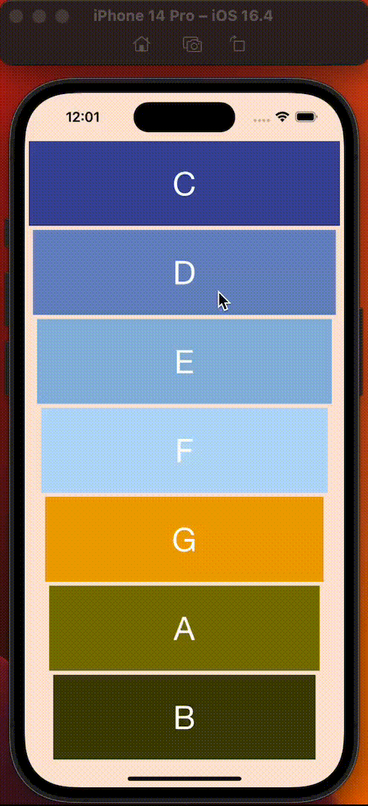

# Xylophone App

  
  

  
## What does the Xylophone App do? ##

Well, as the name suggests, it lets you play a virtual xylophone, duh.

Unlock your musical talent, and see if you can compose amazing musical melodies with your xylophone app!
